<a href="https://kdominic89.github.io/kdominic89/">
  <picture>
    <source media="(prefers-reduced-motion: reduce)" srcset="assets/sourcefield.static.svg">
    <source media="(prefers-color-scheme: light)" srcset="assets/sourcefield.light.svg">
    
  </picture>
</a>

[Open the interactive profile](https://kdominic89.github.io/kdominic89/) · [Static version](assets/sourcefield.static.svg)

Projects and packages

### Projects

| Project | What it does | Stack |
| --- | --- | --- |
| ai-devops | Hooks, skills, and rules for coding agents | Rust / 6 MCP endpoints |
| BudgetBoard | Personal finance with encrypted storage and backups | Go / SQLCipher / age |
| StateTrace | Filesystem monitoring | Rust / Swift / SQLite |
| DotConfig | Shell, editor, and Git configuration | Zsh / Neovim / Git / Starship |
| vscode-theme | DotConfig Mocha, based on Catppuccin | TypeScript / JSON |
| [Doka.EntityFrameworkCore.MySql](https://github.com/doka-labs/Doka.EntityFrameworkCore.MySql) | Provider, spatial support, and caching | C# / .NET / EF Core |
| [Doka.EntityFrameworkCore.SafeMigrations](https://github.com/doka-labs/Doka.EntityFrameworkCore.SafeMigrations) | Schema migrations for MySQL, MariaDB, and PostgreSQL | C# / .NET / EF Core |
| RelationalLab | A test lab for relational databases | C# / .NET / JavaScript |

### NuGet

- [Doka.EntityFrameworkCore.MySql](https://www.nuget.org/packages/Doka.EntityFrameworkCore.MySql/)
- [Doka.EntityFrameworkCore.MySql.NetTopologySuite](https://www.nuget.org/packages/Doka.EntityFrameworkCore.MySql.NetTopologySuite/)
- [Doka.Caching.MySql](https://www.nuget.org/packages/Doka.Caching.MySql/)
- [Doka.EntityFrameworkCore.SafeMigrations](https://www.nuget.org/packages/Doka.EntityFrameworkCore.SafeMigrations/)
- [Doka.EntityFrameworkCore.SafeMigrations.MySql](https://www.nuget.org/packages/Doka.EntityFrameworkCore.SafeMigrations.MySql/)
- [Doka.EntityFrameworkCore.SafeMigrations.PostgreSql](https://www.nuget.org/packages/Doka.EntityFrameworkCore.SafeMigrations.PostgreSql/)

[Setup](SETUP.md) · [Architecture](ARCHITECTURE.md) · [Privacy](PRIVACY.md) · [Contributing](CONTRIBUTING.md)
